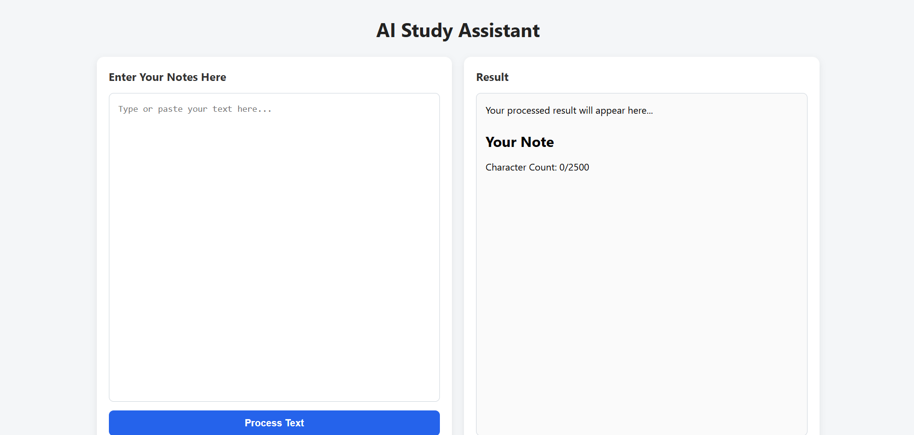

# AI Study Assistant

## Screenshot



## Overview

AI Study Assistant is a web application built with Python and Flask that helps students study more efficiently using artificial intelligence.

Users can enter study notes through a modern web interface and receive AI-generated summaries powered by a locally running language model. The project focuses on learning full-stack web development while integrating practical AI features.

This project serves as a long-term learning experience in Python, Flask, artificial intelligence, and software engineering.

---

## Development Progress

### Version 0.1 - Foundation

Completed:

* Flask installation and setup
* Basic routing
* HTML templates
* CSS styling
* Static file configuration

### Version 0.2 - User Interaction

Completed:

* Note submission form
* POST request handling
* User input processing
* Dynamic page updates
* Character limit implementation
* Character count display
* Persistent text area content after submission

---

**Current Version:** **1.0**
## Features

### AI Features

* AI-powered note summarization
* Local AI integration using LM Studio
* Fast offline AI responses
* Custom AI prompts for summarization

### Web Features

* Flask web application
* Responsive user interface
* Note input form
* Character counter
* Character limit validation
* Dynamic result display
* Form handling with Flask

### Interface

* Modern two-panel layout
* Clean and responsive design
* Scrollable AI response panel
* Improved user experience

---

## Technologies Used

### Backend

* Python
* Flask
* Requests

### Frontend

* HTML
* CSS

### Artificial Intelligence

* LM Studio
* Gemma 1.1 2B Instruct (GGUF)

### Tools

* Visual Studio Code
* Git
* GitHub

---

## Project Structure

```text
ai-study-assistant/

├── app.py
├── README.md
├── templates/
│   └── index.html
└── static/
    └── style.css
```

---

## Current Functionality

* Accepts user study notes
* Sends notes to a local AI model
* Generates AI summaries
* Displays summarized output
* Counts characters entered
* Prevents overly large submissions
* Preserves user input after submission

---

## Planned Features

### Version 1.1

* AI quiz generation
* Multiple AI study modes
* Better prompt selection

### Version 1.2

* Flashcard generation
* Key point extraction
* Vocabulary assistance

### Future Versions

* User accounts
* SQLite database integration
* Progress tracking
* Study history
* Personalized AI recommendations
* Export summaries
* Dark mode

---

## Learning Objectives

This project has helped me learn:

* Python programming
* Flask web development
* Frontend and backend communication
* REST API requests
* JSON parsing
* AI model integration
* Form handling
* Debugging techniques
* User interface design
* Software engineering principles

---

## Why I Built This Project

I built AI Study Assistant to strengthen my programming skills by creating a practical real-world application instead of only following tutorials.

The project combines web development and artificial intelligence while helping me understand how modern AI-powered applications are designed and developed.

---

## Future Goals

This project will continue to evolve as I learn new technologies. Planned improvements include additional AI study tools, database integration, authentication, and more advanced learning features.

---

## Author

**Deniz Ayalp**

Created in 2026.

**Current Status:** Version 1.0 🚀


Created in 2026.
